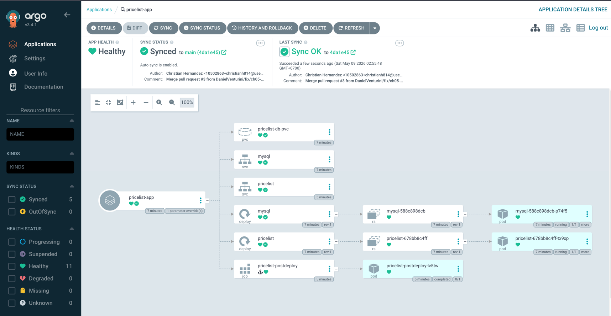

# Database Schema Setup — Sync Waves Hands-On

This exercise deploys a multi-tier pricelist application using ArgoCD **sync waves** and a **PostSync hook** to control the exact order resources come up.

---

## What You Will Build

| Wave | Phase | Manifest | Purpose |
|------|-------|----------|---------|
| 1 | Sync | `pricelist-db-pvc.yaml` | Persistent Volume Claim for MySQL |
| 1 | Sync | `pricelist-db.yaml` | MySQL Deployment |
| 2 | Sync | `pricelist-db-svc.yaml` | MySQL Service |
| 3 | Sync | `pricelist-deploy.yaml` | Web App Deployment |
| 4 | Sync | `pricelist-svc.yaml` | Web App Service |
| 0 | PostSync | `pricelist-job.yaml` | DB schema migration Job |

> ArgoCD processes waves in ascending order and **waits for all resources in wave N to reach Ready** before moving to wave N+1.  
> PostSync runs after every Sync-phase wave has completed.

---

## Prerequisites

- `kubectl` configured against your cluster
- ArgoCD installed in the `argocd` namespace
- You are logged in: `argocd login <argocd-server>`

---

## Step 1 — Fix the Application Manifest

Open [`pricelist-app.yml`](pricelist-app.yml). There is a formatting bug on the finalizers line — `spec:` is concatenated to the finalizer string. Fix it so it reads:

```yaml
  finalizers:
    - resources-finalizer.argocd.argoproj.io
spec:
```

After the fix the full file should look like:

```yaml
apiVersion: argoproj.io/v1alpha1
kind: Application
metadata:
  name: pricelist-app
  namespace: argocd
  finalizers:
    - resources-finalizer.argocd.argoproj.io
spec:
  project: default
  source:
    path: ch05/manifests/
    repoURL: https://github.com/sabre1041/argocd-up-and-running-book
    targetRevision: main
  destination:
    namespace: pricelist
    name: in-cluster
  syncPolicy:
    automated:
      prune: true
      selfHeal: true
    syncOptions:
      - CreateNamespace=true
    retry:
      limit: 5
      backoff:
        duration: 5s
        factor: 2
        maxDuration: 3m
```

---

## Step 2 — Inspect the Source Manifests (read-only)

The manifests live at:  
`https://github.com/sabre1041/argocd-up-and-running-book/tree/main/ch05/manifests`

Before applying anything, **read the sync-wave annotations** in each manifest to confirm they match the table in the intro:

```bash
# Clone the reference repo locally (read-only inspection)
git clone https://github.com/sabre1041/argocd-up-and-running-book.git /tmp/argocd-book
grep -r "sync-wave" /tmp/argocd-book/ch05/manifests/
grep -r "argocd.argoproj.io/hook" /tmp/argocd-book/ch05/manifests/
```

Key annotations to confirm:

| Annotation | File(s) |
|------------|---------|
| `sync-wave: "1"` | `pricelist-db-pvc.yaml`, `pricelist-db.yaml` |
| `sync-wave: "2"` | `pricelist-db-svc.yaml` |
| `sync-wave: "3"` | `pricelist-deploy.yaml` |
| `sync-wave: "4"` | `pricelist-svc.yaml` |
| `hook: PostSync` + `sync-wave: "0"` | `pricelist-job.yaml` |

Also confirm that `pricelist-db.yaml` and `pricelist-deploy.yaml` both have **readiness and liveness probes** — ArgoCD relies on these to know a wave is healthy before advancing.

---

## Step 3 — Apply the ArgoCD Application

```bash
kubectl apply -f pricelist-app.yml
```

This registers the Application with ArgoCD. Because `automated.selfHeal` and `automated.prune` are enabled, ArgoCD will immediately begin a sync.



---

## Step 4 — Watch Sync Waves Execute

Open a second terminal and stream events so you can watch each wave advance:

```bash
# Watch all resources in the pricelist namespace
kubectl get all -n pricelist -w

# In another pane, watch ArgoCD Application status
watch argocd app get pricelist-app
```

You should observe the following sequence:

1. **Wave 1** — PVC and MySQL Deployment appear; ArgoCD waits until the MySQL pod is `Running` and its TCP-3306 probe passes.
2. **Wave 2** — MySQL Service is created.
3. **Wave 3** — Web App Deployment appears; ArgoCD waits until the HTTP-GET `/` on port 8080 returns 200.
4. **Wave 4** — Web App Service is created.
5. **PostSync** — The `pricelist-postdeploy` Job runs the DB schema migration.

---

## Step 5 — Verify the PostSync Job

```bash
# Check the Job completed successfully
kubectl get job pricelist-postdeploy -n pricelist

# Read the migration logs
kubectl logs -n pricelist -l job-name=pricelist-postdeploy
```

Expected: Job status `Complete`, exit code 0.

---

## Step 6 — Verify the Full Application

```bash
argocd app get pricelist-app
```

Expected output:
- `Health Status: Healthy`
- `Sync Status: Synced`

```bash
# Optional: port-forward the web app to verify it loads
kubectl port-forward svc/pricelist -n pricelist 8080:8080
# open http://localhost:8080 in your browser
```

---

## Step 7 — Trigger a Re-sync and Observe Hook Deletion Policy

The `pricelist-job.yaml` carries `hook-delete-policy: BeforeHookCreation`. This means on the **next** sync run, ArgoCD will delete the old Job object before re-creating it.

Force a re-sync to observe this:

```bash
argocd app sync pricelist-app
```

Watch that the `pricelist-postdeploy` Job is deleted then recreated at the PostSync phase.

---

## Cleanup

```bash
# Deleting the Application also deletes all managed resources
# because of the resources-finalizer
kubectl delete -f pricelist-app.yml
```

---

## Key Concepts Summary

| Concept | How it works here |
|---------|------------------|
| **Sync wave** | `argocd.argoproj.io/sync-wave` annotation; lower number = applied first |
| **Wave gating** | ArgoCD waits for all resources in wave N to be `Healthy` (via probes) before wave N+1 |
| **PostSync hook** | `argocd.argoproj.io/hook: PostSync` runs after all Sync waves finish |
| **Hook deletion policy** | `BeforeHookCreation` ensures idempotent re-runs by deleting the old Job first |
| **Readiness probes** | Required for ArgoCD to correctly gate wave advancement |
